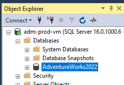

# Azure Database Migration project
TODO: Project description

## Table of contents

## Production Environment Setup

- **VM Acquisition**: Obtained a Virtual Machine named `adm-prod-vm`.
  - **Specs**: Ubuntu Server 20.04 LTS - x64 Gen2, size Standard_B2ms.
- **Software Installation**:
  - Installed Microsoft SQL Server.
  - Installed SQL Server Management Studio (SMSS).
- **Database Restoration**:
  - Restored AdventureWorks2022 database from a backup file.

