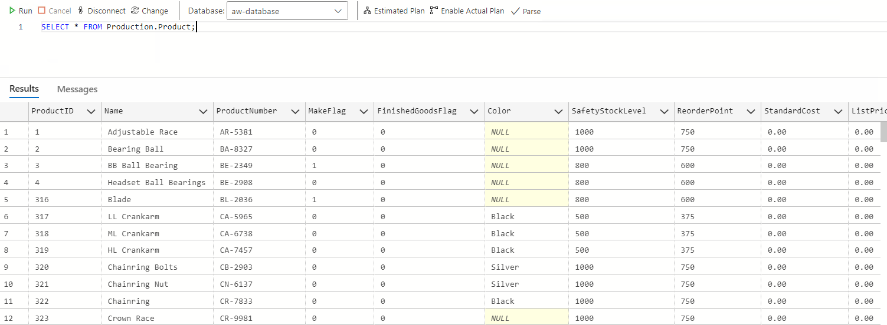
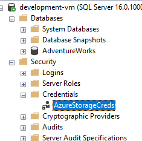
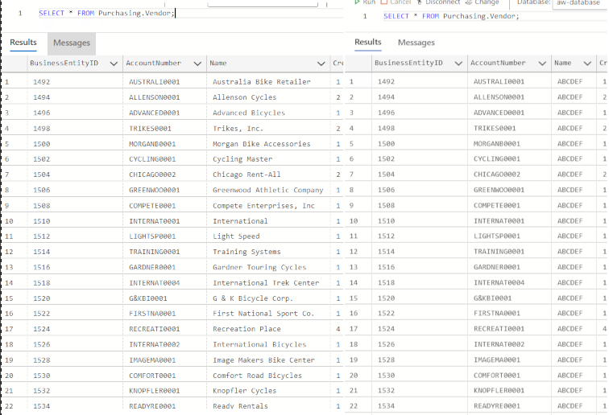
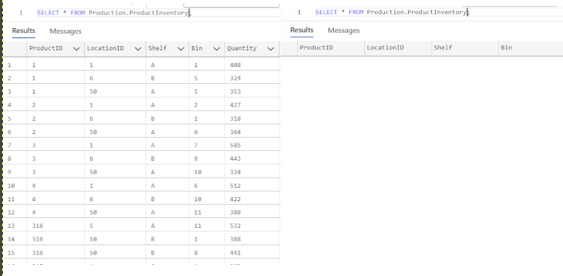
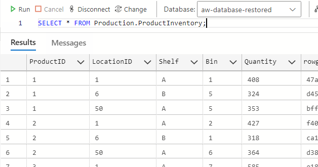
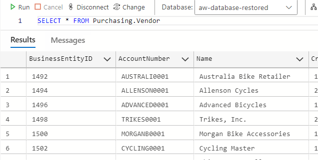

# Azure Database Migration project


TODO: Project description


## Table of contents


## Production Environment Setup
In this section, we outline the initial setup of our production environment. This involves acquiring a new virtual machine, detailing its specifications, and installing essential software including Microsoft SQL Server and SQL Server Management Studio (SMSS). Additionally, we discuss the process of restoring the AdventureWorks2022 database, setting the stage for further migration activities.

<details>
  <summary>Open Logbook</summary>
  <br/><br/>

**VM Acquisition**: Obtained a Virtual Machine named `production-vm`.

**Specs**: 
- **OS**: Windows 11 Pro 2h22
- **Size**: Standard_B2ms

**Software Installation**:
  - Installed Microsoft SQL Server.
  - Installed SQL Server Management Studio (SMSS).

**Database Restoration**:
  - Restored AdventureWorks2022 database from a backup file.

*Figure 2.1: Object explorer displaying the AdventureWorks2022 database*


</details>

## Migrate to Azure SQL Database
Here, we delve into the core process of migrating our database to Azure SQL Database. We start by creating a new database in Azure and configuring the necessary networking settings. This is followed by establishing our initial connection using Visual Studio Code and proceeding with the migration. Key steps include installing Azure Data Studio, connecting to both local and Azure databases, and successfully migrating the schema and data to Azure.
<details>
  <summary>Open Logbook</summary>
  <br/><br/>

**Azure Database Creation**: 
  - Created database `aw-database` on `aw-production-server.database.windows.net`.
**Networking Setup**: 
  - Configured firewall rule in Azure (aw-production-server > Networking) to allow local machine connection.
**Initial Connection**:
  - Connected to the Azure database using Visual Studio Code.

*Figure 3.1: Visual Studio Code displaying connection to Azure SQL Database*


**Tool Installation and Connection**:
  - Downloaded and installed Azure Data Studio.
  - Established connections to both local and Azure databases.
  
**Schema Migration**:
  - Migrated schema from the local SQL database to Azure using SQL Server Schema Compare in Azure Data Studio.

*Figure 3.2: Showing successful schema migration*


**Data Migration**:
  - Set up a Database Migration service in Azure and registered an Integration Runtime.
  - Migrated data to Azure database using Azure SQL Migration in Azure Data Studio. Migration confirmed successful.


*Figure 3.3: Showing successful data migration*


*Figure 3.4: Query made on Azure SQL database confirming migration*


The database has been migrated to Azure!
</details>

## Data Backup and Restore
This section focuses on the crucial tasks of data backup and restoration. Initially, we create a full backup of our production database to ensure data safety. Then, we set up an Azure storage account for backup file storage and upload the backup file to it. The section also covers the creation of a development VM for testing, the restoration of the AdventureWorks database on this VM, and the configuration of automated backups using SQL Server Agent and Maintenance Plans in SMSS.

<details>
  <summary>Open Logbook</summary>
  <br/><br/>

**Backup Creation**: Generated full backup of `production-vm` database.

*Figure 4.1: On-premise database backup*  


**Azure Storage Setup**: Configured `awproductionstorage` for backup storage.

**Backup Upload**: Uploaded backup file to `onpremisebackup` container.

*Figure 4.2: `onpremisebackup` storage container contents*  


**Development VM Setup**: Created `development-vm` for testing.

**Specs**: 
- **OS**: Windows 11 Pro 2h22
- **Size**: Standard_B2ms

**Software Installation**:
  - Installed Microsoft SQL Server.
  - Installed SQL Server Management Studio (SMSS).

**Software Installation**: Installed SQL Server and SMSS.

**Database Restoration**: Restored AdventureWorks database on `development-vm`.

*Figure 4.3: Restored database on development VM*  


**Automated Backup Configuration**:
  1. Activated SQL Server Agent.
  2. Created SQL Server Credentials for Azure storage.
  3. Verified credentials in SMSS.
  
*Figure 4.4: Azure Storage credentials in SMSS*  


  4. Configured `Scheduled Backup` via Maintenance Plan Wizard.
  5. Set backup schedule: Weekly on Saturdays at 12:00 AM.
  6. Directed backups to Azure storage container.

*Figure 4.5: Backup destination configuration*  


  7. Validated backup by manual execution and Azure storage check.

*Figure 4.6: Backup validation*  


</details>

## Disaster Recovery Simulation

In this section, we will conduct a disaster recovery simulation to test our preparedness for data loss or corruption in the Azure SQL database. The process involves intentionally creating scenarios that mimic real-world data disasters, such as deleting critical data and inducing data corruption. This simulation will not only test our ability to recover from such incidents but also evaluate the effectiveness of our backup and restore strategies under pressure.

<details>
  <summary>Open Logbook</summary>
  <br/><br/>

### Simulating data loss and corruption

To simulate data loss, I plan to delete all entries in the `Production.ProductInventory` table and the `Purchasing.Vendor` table. To mimic data corruption, I will modify the `Purchasing.Vendor` table by setting all `AccountNumbers` to NULL. This will be done by executing the following queries:


```
DELETE FROM Production.ProductInventory;;
```

```
UPDATE Purchasing.Vendor
SET Name = 'ABCDEF';
```
*Figure 5.1: Purchasing.vendor table before (left) and after (right) data corruption*


*Figure 5.2: Production.ProductInventory table before (left) and after (right) data loss*


### Restoring Database
To restore the database I went onto the Azure portal, and into the `aw-database` and select Restore.

From here I select the restore point to midnight the same day, before the deletion and corruption occurred and set the databases name to `aw-database-restored`.

To then check these I ran a `SELECT * FROM table` query.

*Figure 5.3: Production.ProductInventory table after restoration*


*Figure 5.4: Purchasing.vendor table after restoration*


</details>