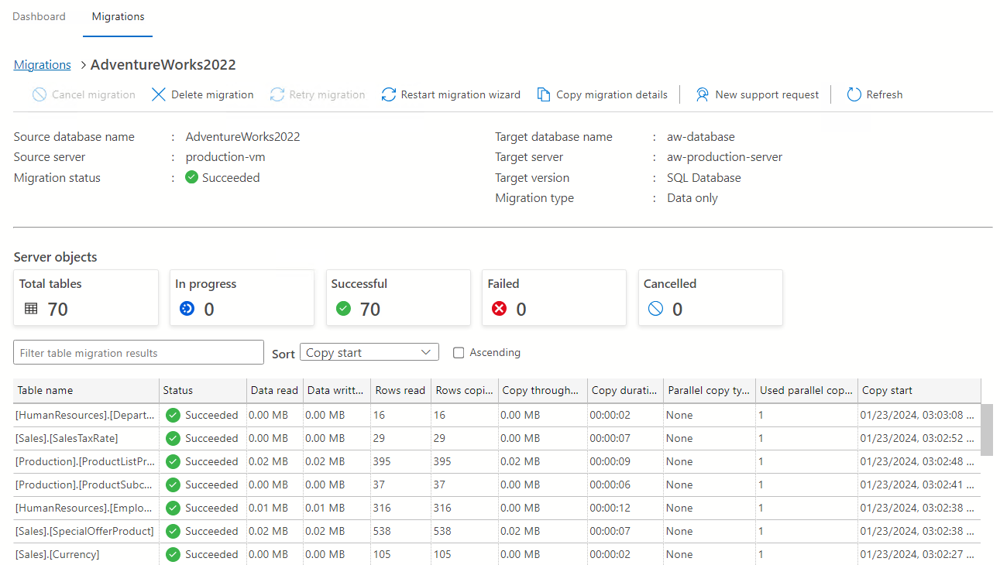

# Azure Database Migration project

TODO: Project description

## Table of contents

## Production Environment Setup

**VM Acquisition**: Obtained a Virtual Machine named `adm-prod-vm`.

**Specs**: 
- **OS**: Windows 11 Pro 2h22
- **Size**: Standard_B2ms

**Software Installation**:
  - Installed Microsoft SQL Server.
  - Installed SQL Server Management Studio (SMSS).

**Database Restoration**:
  - Restored AdventureWorks2022 database from a backup file.

## Migrate to Azure SQL Database

**Azure Database Creation**: 
  - Created database `AdventureWorks2022` on `aw2022.database.windows.net`.
**Networking Setup**: 
  - Configured firewall rule in Azure (aw2022 > Networking) to allow local machine connection.
**Initial Connection**:
  - Connected to the Azure database using Visual Studio Code.

**Tool Installation and Connection**:
  - Downloaded and installed Azure Data Studio.
  - Established connections to both local and Azure databases.
  
**Schema Migration**:
  - Migrated schema from the local SQL database to Azure using SQL Server Schema Compare in Azure Data Studio.

**Data Migration**:
  - Set up a Database Migration service in Azure and registered an Integration Runtime.
  - Migrated data to Azure database using Azure SQL Migration in Azure Data Studio. Migration confirmed successful.

The database has been migrated to Azure!